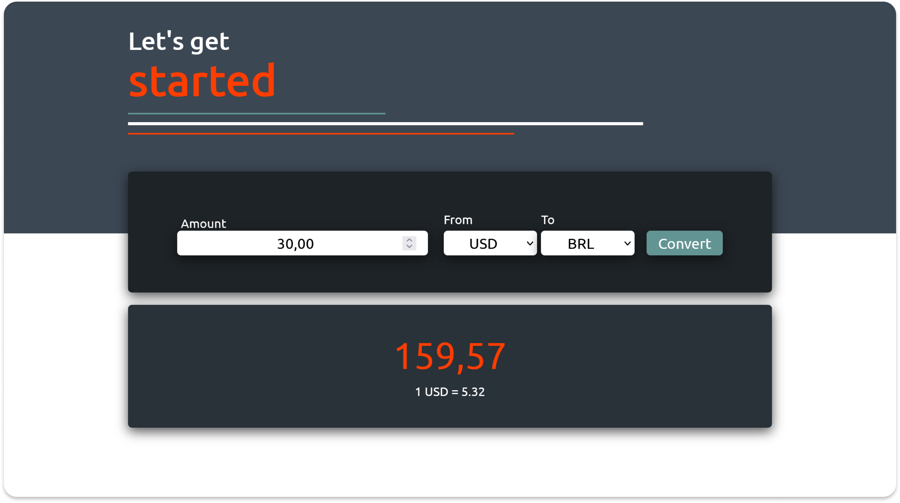

# api-conversor-de-moeda
Aplicação para conversão de moedas utilizando API.

  

# Descrição:
Essa aplicação foi desenvolvida para consolidar os conhecimentos e aprimorar as práticas em APIs com Fetch() e async function.

Para utilização, primeiro deve escolher a moeda base em FROM e depois a moeda para conversão em TO.
O resultado irá aparecer logo abaixo, informando o valor de conversão e o valor unitário da moeda base, referente a ultima atualização da API.

Já no layout, criei uma animação na interface com logo intuitivo, onde o "X" faz uma junção com a palavra "change", formando EXCHANGE, que representa todo o significado da aplicação.

> API Utilizada: https://www.frankfurter.app/

## Funcionalidades:
- [x] Calculo de moedas;
- [x] 33 tipos de moedas;
- [x] Site responsivo;

## Layout Responsivo:

  

## Principais desafios em JavaScript:

- Estruturar a API;
- Utilização e compreensão de callbacks;
- Entender o método Object.entries();
- Como pegar um valor do select utilizando a propriedade selectedIndex;

## Principais desafios em CSS:
- Criar animação com SVG;
- Trablhar com stroke-dasharray e stroke-dashoffset; 
- Keyframes.
  
## Tecnologias:

